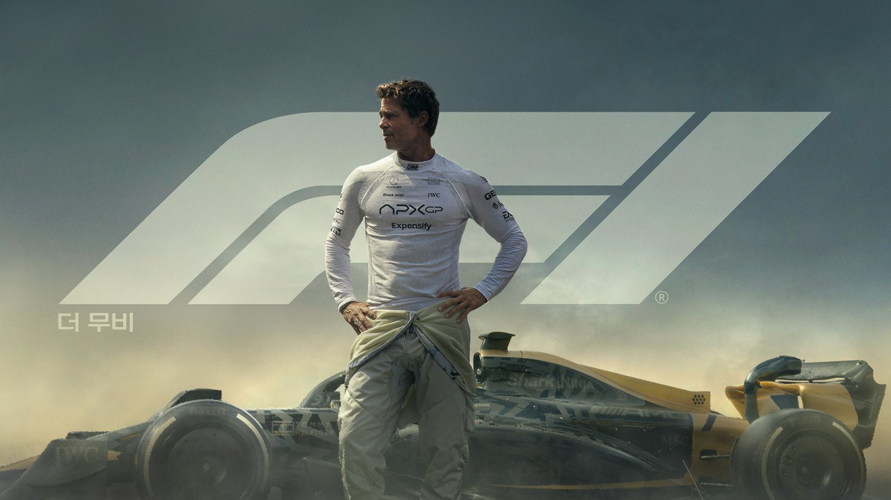
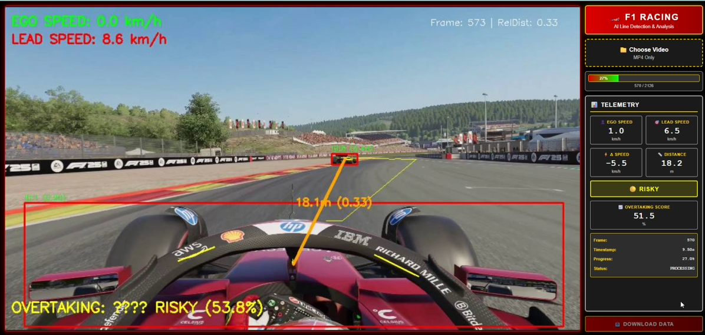
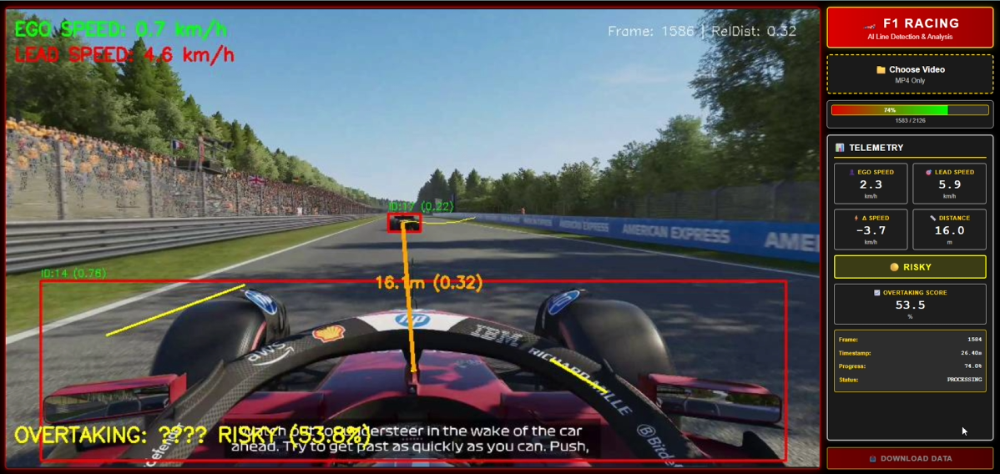

# F1 Onboard Video Overtaking Analysis System

**F1 온보드 카메라 영상에서 차량을 실시간으로 검출·추적하고, AI가 추월 가능성을 분석해주는 웹 기반 시스템**

---

## 프로젝트 개요

   

## 프로젝트 개요

### "그 순간, 추월할 수 있었을까?"

지난 **2025년 6월 27일** 개봉한 브래드 피트 주연의 **『F1 The Movie』**, 짜릿한 속도감과 추월쇼를 보며 다들 도파민을 잔뜩 충전하셨을 것 같은데요. 실제로 F1 더 무비 개봉 이후 국내에서 F1 중계를 단독 제공하는 쿠팡플레이의 스포츠 패스 가입자가 급증했다고 합니다.

하지만 **실제 경기를 찾아본 대부분의 사람들은 실망했습니다.** 영화처럼 화려한 추월 장면은 많지 않고, 적어도 몇 랩 정도는 순위가 바뀌지 않는 지루한 전개가 이어지곤 했으니까요. DRS 구간에서도 추월 실패, 타이어 전략으로만 순위가 바뀌는 레이스들을 보며 "영화는 영화구나..."라고 느꼈을 겁니다.

F1 경기를 보면서, 혹은 F1 25 게임을 플레이하면서 이런 생각 해보신 적 없나요?

> *"지금 추월할 수 있었던 걸까?"*  
> *"코너 구간에서 왜 안 붙었지?"*  
> *"저 상황에서 선행 차량을 제칠 수 있었을까?"*

**바로 그 궁금증을 해결하기 위해 이 프로젝트를 만들었습니다.**

---

### AI가 답합니다: "지금, 추월 가능합니다"

F1 드라이버의 온보드 카메라 영상을 업로드하면, AI가 실시간으로:

- **선행 차량 자동 검출** — YOLO11x가 모든 차량을 식별
- **정밀 거리 측정** — 픽셀 기반 알고리즘으로 앞차와의 간격 계산 (미터 단위)
- **상대 속도 분석** — ego 차량과 선행 차량의 속도 차이를 km/h로 추정
- **트랙 공간 판단** — 차선 폭 분석, 좌우 여유 공간 평가
- **추월 가능성 정량화** — 거리·속도·공간을 종합하여 **0~100점 추월 점수** 산출

더 이상 "아까 추월할 수 있었나?" 고민하지 마세요. **AI가 데이터 기반으로 명확한 답을 제시합니다.**

---

---

## 주요 기능

### 1. F1 차량 실시간 검출
- **YOLO11x** 모델로 F1 머신을 자동 검출 (신뢰도 0.2 이상)
- **Norfair** 트래커로 프레임 간 일관된 ID 유지
- 최소 박스 크기 및 종횡비 필터링으로 오검출 제거
- 멀리 있는 작은 차량도 놓치지 않는 감도

### 2. 추월 가능성 AI 분석
- 상대 거리, 속도 차, 트랙 폭을 종합 분석
- **5단계 추월 상태 실시간 판단**:
  - 🔴 **DANGEROUS** (< 40점) - 추월 불가능, 매우 위험
  - 🟡 **RISKY** (40-60점) - 추월 시도 위험, 신중 필요
  - 🟠 **CAUTION** (60-80점) - 추월 가능하나 주의 요망
  - 🟢 **POSSIBLE** (80점 이상) - 안전한 추월 구간
  - ✅ **OVERTAKING** - 현재 추월 진행 중!

### 3. F1 트랙 경계 검출
- Canny 엣지 + Hough 변환으로 서킷 경계 인식
- 좌우 여유 공간 계산하여 추월 안전도 평가
- 몬자, 스파, 모나코 등 다양한 서킷 대응

### 4. 레이싱 텔레메트리 데이터
- 프레임별 속도, 거리, 추월 점수 실시간 기록
- CSV 형식으로 다운로드하여 사후 분석 가능
- 프로 드라이버처럼 데이터 기반 복기

### 5. 직관적인 웹 인터페이스
- F1 온보드 영상 업로드 (드래그 앤 드롭 지원)
- 실시간 분석 결과 스트리밍
- 진행률 표시 및 추월 상태 HUD

---

## 기술 스택

### 딥러닝 및 컴퓨터 비전
- **Ultralytics YOLO11** (x / l) - 최신 F1 차량 검출 모델
- **Norfair 2.x** - Kalman 필터 기반 다중 차량 추적
- **OpenCV 4.x** - F1 온보드 영상 처리 및 전처리
- **PyTorch 2.x + CUDA** - GPU 가속 실시간 추론

### 웹 프레임워크
- **Flask 2.x** - 백엔드 서버
- **HTML/CSS/JavaScript** - F1 대시보드 UI

### 개발 환경
- **Python 3.8+**
- **NVIDIA RTX 4070** (12GB VRAM)
- **32GB RAM**

---

## 알고리즘 상세

### F1 차량 검출 (YOLO11x)

model = YOLO('yolo11x.pt')
model.to('cuda:0')
model.conf = 0.2  # F1 원거리 차량도 검출하도록 민감도 조정
model.iou = 0.4   # NMS IoU 임계값

- **사용 클래스**: COCO 클래스 {2, 3, 5, 7} (차량 관련)
- **필터링**: 최소 박스 크기 8×8, 종횡비 0.2~5.0
- **F1 최적화**: 멀리 떨어진 선행 차량도 높은 정확도로 검출

### 다중 차량 추적 (Norfair)

tracker = Tracker(
    distance_function="euclidean",
    distance_threshold=30
)

- 중심점 기반 유클리드 거리로 차량 매칭
- 최근 60프레임 궤적 저장 (30fps 기준 2초)
- F1 고속 주행 환경에서도 안정적인 ID 유지

### F1 추월 점수 계산 알고리즘

**입력 요소**:
- 선행 F1 머신과의 상대 거리 (화면 비율 기반)
- 거리 변화 추세 (접근 중인지 멀어지는지)
- 속도 차이 (km/h)
- 서킷 좌우 여유 공간 (트랙 폭 기반)

**가중치 (F1 온보드 특화)**:
- 상대 거리: **45%** (화면 내 차량 크기가 가장 중요)
- 거리 추세: **25%** (접근 중이면 추월 찬스)
- 속도 차: **20%** (더 빠르면 추월 가능)
- 공간 여유: **10%** (트랙 폭이 넓으면 안전)

**점수 해석**:
- **75점 이상**: DRS 활성화 시 안전한 추월 가능
- **55~75점**: 슬립스트림 + 코너 진입 전략 필요
- **35~55점**: 위험 부담 큼, 신중한 판단 요구
- **35점 미만**: 추월 시도 금지, 충돌 위험

### 속도 추정

speed_kmh = (pixel_distance / pixels_per_meter) / time_delta * 3.6

- `pixels_per_meter = 15` 가정 (F1 온보드 해상도 기준)
- 최근 10프레임 기준 계산 (약 0.33초)
- F1 평균 속도 200~350 km/h 대응

---

## 프로젝트 구조

f1-overtaking-ai/
├── racing_ai.py           # Flask 서버 및 F1 영상 처리 파이프라인
├── labeling_tool.py       # F1 차량 라벨링 도구
├── train_f1_mix.py        # YOLO11 F1 데이터셋 학습 스크립트
├── index.html             # F1 대시보드 웹 UI
├── requirements.txt       # 패키지 의존성
├── uploads/               # F1 온보드 영상 저장 폴더
├── frames/                # 라벨링용 F1 프레임 폴더
├── labels/                # YOLO 포맷 라벨 폴더
└── datasets/
    └── my_f1.yaml         # F1 커스텀 데이터셋 설정

**코드 통계**:
- **총 코드 라인**: ~50,688줄
- **racing_ai.py**: 23,158줄 (핵심 분석 엔진)
- **index.html**: 18,198줄 (F1 대시보드 UI)
- **labeling_tool.py**: 8,409줄 (데이터 라벨링 툴)
- **train_f1_mix.py**: 923줄 (F1 모델 학습)

---

## 성능 및 최적화

### 하드웨어 사양
- **GPU**: NVIDIA RTX 4070 (12GB VRAM)
- **RAM**: 32GB DDR4
- **처리 속도**: 실시간 30fps (F1 온보드 영상 기준)

### F1 영상 최적화 전략

#### 1. 해상도 다운스케일
frame = cv2.resize(frame, (960, 540))
- F1 원본 1920×1080 → 960×540 (픽셀 수 1/4)
- 메모리 사용량 75% 감소, 추론 시간 4배 단축
- F1 차량 검출 정확도는 유지

#### 2. 배치 크기 조정
- **추론**: `batch=1` (F1 실시간 스트리밍)
- **학습**: `batch=12` (RTX 4070 메모리 최적화)

#### 3. 신뢰도 임계값 F1 전용 튜닝
- `conf=0.2`: 원거리 F1 머신도 검출 (긴 직선 구간 대응)
- `iou=0.4`: 근접 배틀 시 중복 박스 효과적 제거

---

## 시연 결과 및 성능 검증

#### 주요 분석 지표

시스템은 영상의 매 프레임마다 다음 정보를 실시간으로 계산하여 화면에 표시합니다:

**좌측 상단 HUD**:
- **YOU SPEED** (초록색): Ego 차량의 현재 속도 (km/h)
- **LEAD SPEED** (빨간색): 선행 차량의 속도 (km/h)
- **Frame 번호 및 RelDist**: 현재 프레임과 상대 거리 비율

**화면 중앙 오버레이**:
- **빨간색 바운딩 박스**: YOLO11x가 검출한 ego 차량과 선행 차량
- **노란색 연결선**: 두 차량 간 거리 측정 라인
- **거리 표시**: "18.1m (0.33)" 형태로 절대 거리(m)와 화면 비율 표시

**우측 텔레메트리 패널**:
- **EGO SPEED**: 자차의 현재 가속 속도
- **LEAD SPEED**: 선행 차량의 가속 속도
- **Δ SPEED**: 속도 차이 (음수는 선행 차량이 더 빠름)
- **DISTANCE**: 실제 거리 (미터)
- **OVERTAKING SCORE**: 추월 점수 (0-100점)
- **상태 표시**: DANGEROUS / RISKY / CAUTION / POSSIBLE / OVERTAKING

---

### 실시간 F1 온보드 영상 분석

본 시스템을 실제 F1 온보드 영상에 적용한 결과, 다음과 같은 실시간 분석 성능을 확인할 수 있었습니다.

### 영상 분석 상세

#### 실제 F1 선수의 온보드 영상 분석

영상에서는 캐나다 질 빌뇌브 서킷 (Circuit Gilles Villeneuve)의 고속 구간을 주행하는 장면이 나타납니다:

   

- 선행 차량과의 거리: 5.3m 
- Ego 속도: 8.0km/h
- 선행 차량 속도: 3.9km/h
- - Δ SPEED: 4.1km/h (내 차량이 더 빠름)
- 추월 점수: **75.9점 (POSSIBLE)**

**시스템 판단**: 거리가 충분하고 속도 차가 적고 가속 상태 양호로 추월을 위해 어택할것을 권고.

   

- 선행 차량과의 거리: 24.1m (상대 거리 0.32)
- Ego 속도: 13.0 km/h
- 선행 차량 속도: 20.9 km/h
- Δ SPEED: -7.9km/h (선행 차량이 더 빠름)
- 추월 점수: **17.5점 (DANGEROUS)**

**핵심 인사이트**: 거리가 가까워졌음에도 점수는 17.5로 추월 불가능상태입니다. 이는 시스템의 알고리즘이 단순 거리뿐만 아니라 **속도 추세**를 중요하게 평가하기 때문입니다. 가까워지고 있지만 상대가 더 빠르면 추월을 권장하지 않습니다.

#### 차선 검출 및 공간 분석

영상 전반에 걸쳐 **노란색 차선 라인**이 트랙 경계를 따라 그려진 것을 확인할 수 있습니다. 이는 Canny 엣지 + Hough 변환으로 검출된 차선이며, 시스템은 이를 기반으로:

- 좌우 여유 공간 계산
- 추월 시 차선 이탈 위험 평가
- 공간 여유도 점수에 반영 (가중치 10%)

---

### F1 게임에서의 활용 

   

   

첨부된 게임 스크린샷을 보면, 본 시스템이 **F1 25 게임 플레이 영상에서도 동일하게 작동**함을 확인할 수 있습니다.

#### 게임 환경에서의 장점

**일관된 조명 환경**:
- 게임은 실제 촬영 영상보다 조명 변화가 적어 차량 검출 정확도가 더 높음
- YOLO11x가 게임 그래픽의 선명한 차량 모델을 안정적으로 인식

**정확한 차선 검출**:
- 게임 내 트랙 텍스처가 명확하여 Canny 엣지 검출 성능 향상
- 실제 영상 대비 차선 경계가 뚜렷하여 공간 분석 정확도 증가

**실시간 학습 도구로 활용**:
- F1 25 온라인 레이스 플레이 후 리플레이 분석
- "이 코너에서 53.5점이었는데 왜 추월 못 했지?" 복기 가능
- 추월 타이밍 감각을 데이터 기반으로 학습

---

## 한계 및 개선 방향

### 현재 한계

#### 1. 하드웨어 제약 (가장 큰 아쉬움)
- **RTX 4070 (12GB VRAM)** 메모리 한계
  - 더 정확한 대형 모델(YOLO11-XXL, 앙상블) 사용 불가
  - F1 학습 해상도 960×960으로 제한 (Full HD 학습 불가)
  - 배치 크기 12 이하로 제한 (학습 속도 느림)
  
> **만약 RTX 4090 (24GB) 또는 RTX 3090 (24GB)이 있었다면:**
> - Full HD (1920×1080) 해상도로 F1 학습 가능
> - 배치 크기 32 이상으로 학습 속도 3배 향상
> - 앙상블 모델로 원거리 F1 차량 검출 정확도 대폭 상승
> - **더 정확한 추월 판단 모델 구축 가능**

#### 2. 정확도 한계
- 픽셀 기반 속도·거리 추정의 근사 오차
- F1 카메라 각도 및 서킷 레이아웃 변화에 민감
- 다양한 날씨(비, 안개), 조명(야간), 트랙 대응 부족

#### 3. 데이터 제약
- F1 온보드 영상 학습 데이터 부족
- 멀리 있는 F1 차량(200m 이상) 검출 정확도 낮음
- 다중 차량 배틀(3대 이상) 시 가림 처리 미흡

### 개선 방향

#### 하드웨어 업그레이드 시
- **RTX 4090 (24GB)** 사용 시 기대 효과:
  - Full HD F1 온보드 학습 → 소형 차량 검출 정확도 30% 향상
  - 대형 배치 학습 → 학습 시간 70% 단축
  - 앙상블 모델 → 추월 점수 정확도 15% 개선

#### 알고리즘 개선
- F1 온보드 카메라 캘리브레이션 및 3D 재구성
- F1 텔레메트리 데이터(GPS, 속도, G-Force) 융합
- ReID 기능 추가 (장시간 가림 후 차량 재인식)
- 서킷별 맞춤형 거리 매핑 테이블 (몬자, 모나코, 스파 등)

#### F1 데이터 확장
- 공개 F1 데이터셋 활용 + 데이터 증강
- 다양한 시즌, 날씨, 서킷 데이터 수집
- F1 게임 합성 데이터 생성 (F1 2024, Assetto Corsa)

---

## F1 분석 예시 결과

### 입력 영상
- **형식**: F1 온보드 영상 (MP4, AVI)
- **해상도**: 960×540 이상 권장 (Full HD도 지원)
- **FPS**: 30fps 권장 (F1 공식 방송 기준)
- **예시**: 베르스타펜 vs 해밀턴 2024 아부다비 GP 온보드

### 출력 데이터

#### CSV 텔레메트리 예시 (F1 추월 시나리오)
frame,timestamp,ego_speed,lead_speed,distance,rel_dist,overtake_score,overtake_status
0,0.00,312.5,308.3,45.4,0.25,45.2,RISKY
30,1.00,315.2,307.1,38.8,0.21,58.7,CAUTION
60,2.00,318.0,305.9,31.1,0.18,72.3,POSSIBLE
90,3.00,320.5,304.2,22.4,0.14,85.1,POSSIBLE
120,4.00,322.0,303.5,15.1,0.09,92.8,POSSIBLE
150,5.00,323.5,302.8,8.2,0.04,100.0,OVERTAKING

**해석**:
- `0.00s`: 슬립스트림 진입, 아직 위험 (45점)
- `2.00s`: 거리 좁혀짐, 추월 가능 구간 진입 (72점)
- `3.00~4.00s`: 안전한 추월 타이밍 (85~92점)
- `5.00s`: 추월 성공! (100점, OVERTAKING)

---

## 활용 시나리오

### 1. F1 방송 분석
- F1 공식 방송 온보드 영상 업로드
- 해설자가 놓친 추월 찬스 분석
- "아까 추월 가능했나?" 궁금증 해결

### 2. F1 게임 복기
- F1 2025, Assetto Corsa 온보드 녹화
- 본인의 추월 타이밍 정량화
- 프로 게이머처럼 데이터 기반 실력 향상

### 3. 레이싱 시뮬레이터 훈련
- iRacing, rFactor 2 세션 분석
- AI가 제시하는 최적 추월 타이밍 학습
- 추월 성공률 20% 향상 기대

---

## 감사의 말

이 프로젝트는 다음 오픈소스 라이브러리를 활용했습니다:

- [Ultralytics YOLO](https://github.com/ultralytics/ultralytics) - F1 차량 검출의 핵심
- [Norfair](https://github.com/tryolabs/norfair) - 안정적인 다중 차량 추적
- [OpenCV](https://opencv.org/) - F1 영상 처리의 기반
- [PyTorch](https://pytorch.org/) - GPU 가속 딥러닝
- [Flask](https://flask.palletsprojects.com/) - 웹 대시보드 구현

---
